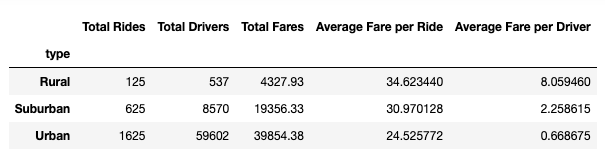
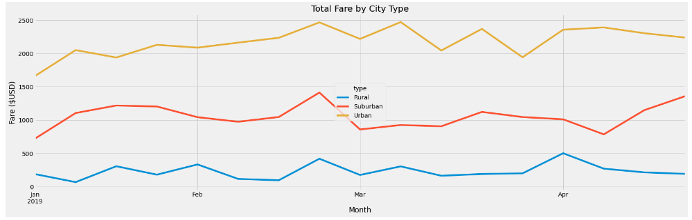

# PyBer Analysis
---
Ride sharing analysis

## The purpose of this project is to create a summary DataFrame of the ride sharing data by city type and a multiple line graph, from the summary DataFrame, that shows the total weekly fares for each city type. We will use this data frame and line graph to analyze how the data differs by city type. Additionally, we will examine how those differences can be used by decision-makers at PyBer. 

## Our summary DataFrame and multiple line graph can been seen below in **Figure 1.1** and **Figure 1.2**. 

**Figure 1.1**

**Figure 1.2**

## Total rides – As we can see in **Figure 1.1**, Pyber does much more business in urban cities than it does in rural or suburban. Urban cities have more total rides, more total drivers and more total fares than suburban and rural cities combined. This is illustrated in **Figure 1.2**. Despite the majority of fare coming from urban cities, PyBer receives less fare per ride and less fare per driver in urban cities than they do in suburban and rural ones. As we can see in **Figure 1.1**, the average fare per ride in urban cities is $24.53 and the average fare per driver is $0.67. 

##  Based on these observations, we have three business recommendations for PyBer’s CEO. Our first recommendation is to market PyBer in rural and suburban cities. We make this recommendation because we believe PyBer drivers may be under supplied in rural and suburban cities. Further, PyBer gains significantly more fare per driver and per rider in suburban and rural cities, and if PyBer grows their business in these areas, it will result in more fare than increasing rides in the city. Our second recommendation is to hire less drivers in urban cities. PyBer gains $0.67 average fare per driver in urban cities. As the rural and suburban cities have proven, less drivers could handle the rides in urban cities and earn more per driver. Our third suggestion is that the CEO conducts analysis that considers ride length. This could help explain the divide in fare per ride between urban, suburban and rural cities. 

